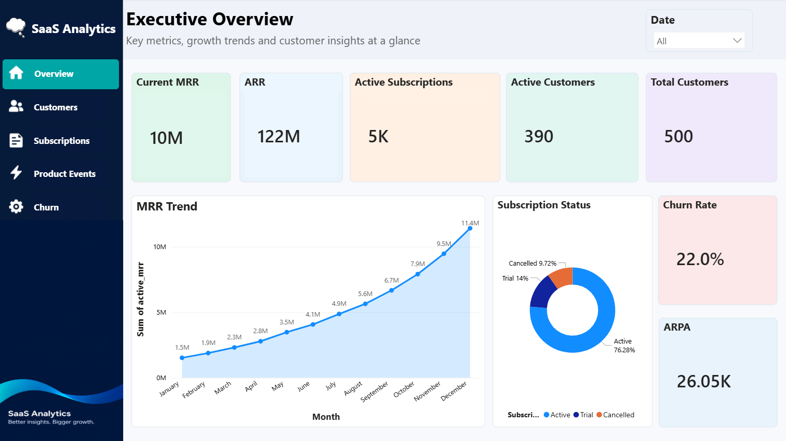
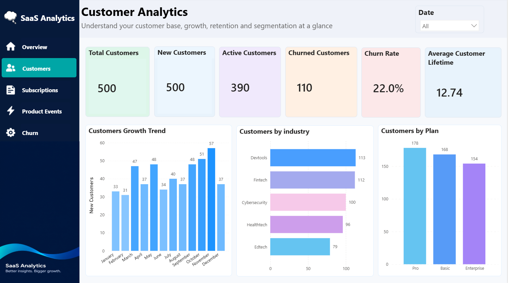
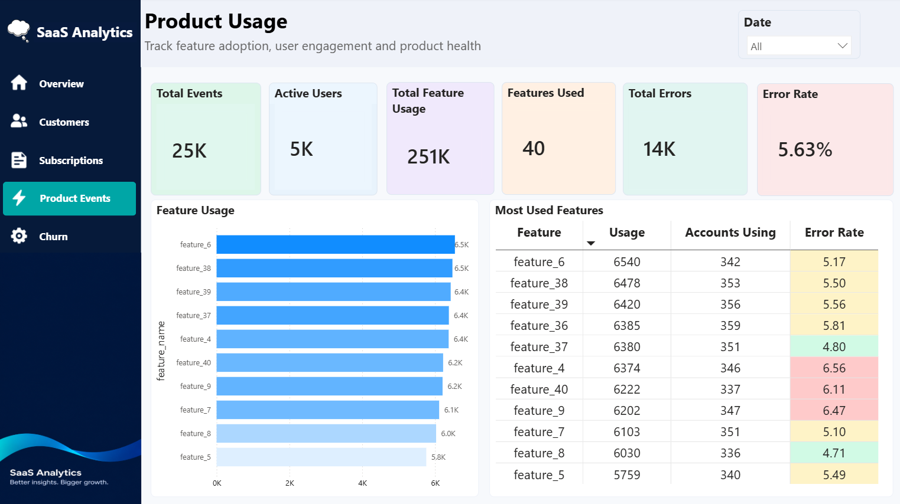
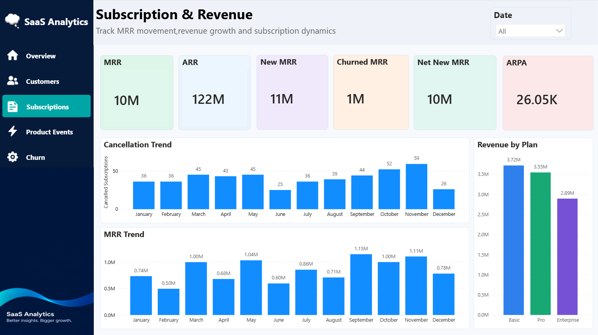
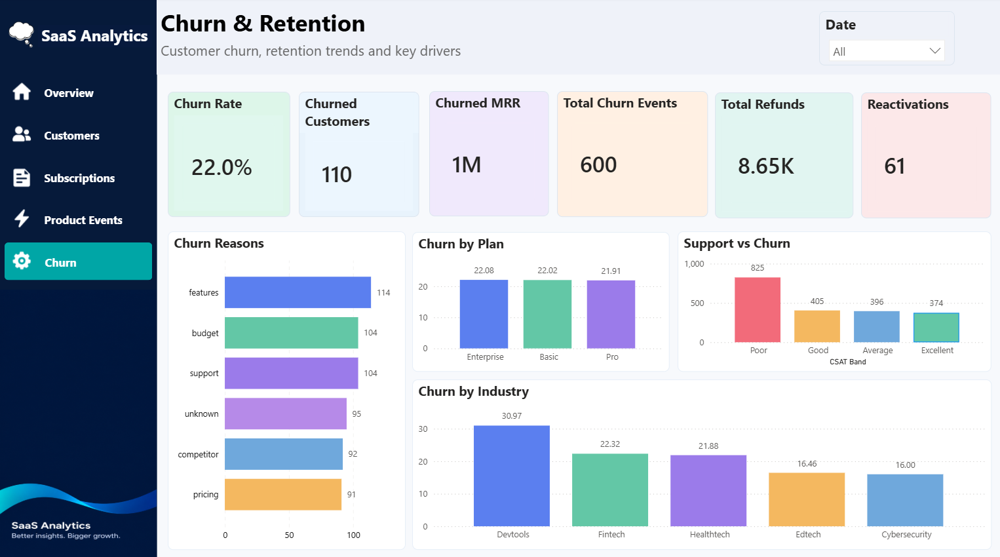

# SaaS Analytics — End-to-End Data Analytics & Power BI Project


## 📊 Project Overview

**SaaS Analytics** is an end-to-end analytics project designed to analyze customer growth, subscriptions, recurring revenue, product usage, support activity, churn, retention, and churn risk for a SaaS business.

The project uses a **RavenStack SaaS Subscription & Churn Analytics** dataset and combines:

- **Python** for data cleaning, analysis, synthetic event generation, churn-risk modeling, chart generation, and exports
- **MySQL 8.0+** for relational storage, data-quality checks, analytical views, and SQL analysis
- **Power BI** for the interactive executive dashboard and business reporting
- **Excel / CSV** for analytical outputs and Power BI-ready datasets

The Python pipeline reads five source tables, cleans and validates them, loads the data into MySQL, performs KPI/churn/MRR/feature/support analysis, trains a churn-risk model, and exports Excel and Power BI-ready CSVs.
  

---

## 🎯 Business Objectives

The dashboard and analytical pipeline answer questions such as:

1. How much recurring revenue does the SaaS business generate?
2. How many customers are active and how many have churned?
3. What is the current churn rate?
4. Which plans and industries have higher churn?
5. What are the leading churn reasons?
6. How is MRR changing month by month?
7. Which plans contribute the most revenue?
8. Which product features are used most?
9. Which features have comparatively high error rates?
10. What is the relationship between support experience and churn?
11. Which customers may be at risk of churn?
12. Can product engagement and early activation be used as churn-risk signals?

---

# 🧱 Project Architecture

```text
                         ┌──────────────────────┐
                         │   SaaS Source Data   │
                         │  5 CSV Data Tables   │
                         └──────────┬───────────┘
                                    │
                                    ▼
                         ┌──────────────────────┐
                         │       Python         │
                         │ Clean + Validate     │
                         │ Transform + Analyze  │
                         └──────────┬───────────┘
                                    │
                    ┌───────────────┼────────────────┐
                    │               │                │
                    ▼               ▼                ▼
              ┌──────────┐   ┌────────────┐   ┌──────────────┐
              │  MySQL   │   │ Excel/CSV  │   │ Synthetic    │
              │  Schema  │   │  Outputs   │   │ Product      │
              │ + Views  │   │            │   │ Events       │
              └────┬─────┘   └─────┬──────┘   └──────┬───────┘
                   │               │                 │
                   └───────────────┼─────────────────┘
                                   ▼
                           ┌──────────────┐
                           │   Power BI   │
                           │ Interactive  │
                           │ Dashboards   │
                           └──────────────┘
```

---

# 🗂️ Source Data Model

The project works with five core business tables:

| Table | Main purpose |
|---|---|
| `accounts` | Customer/account profile, plan, industry, country, signup and churn status |
| `subscriptions` | Subscription lifecycle, MRR, ARR, upgrades, downgrades, billing and auto-renewal |
| `feature_usage` | Feature usage, usage volume, duration, errors and beta-feature flag |
| `support_tickets` | Support volume, response time, resolution time, CSAT and escalations |
| `churn_events` | Churn date, churn reason, refunds, preceding plan changes and reactivation |


The MySQL schema defines primary keys, indexes and foreign-key relationships between these tables. The SQL file also creates analytical views including `vw_account_360`, `vw_monthly_mrr`, `vw_churn_reasons`, and `vw_feature_adoption`.

---

# 🧹 Data Cleaning & Quality

The Python pipeline performs data-quality processing before analysis.

### Cleaning includes

- Removing duplicate header rows
- Removing exact duplicate records
- Removing duplicate primary IDs
- Removing rows with missing primary IDs
- Standardizing text fields
- Converting dates to datetime
- Converting numeric fields to numeric types
- Converting Boolean-style fields to flags
- Removing/NULLing invalid negative MRR
- Handling subscription end dates earlier than start dates
- Handling feature usage with negative usage counts
- Handling support tickets closed before submission
- Validating CSAT values to the 1–5 range
- Removing orphan foreign-key records
- Auditing churn-flag vs churn-event consistency


The SQL project also provides explicit data-quality queries for row counts, churn-log mismatches, invalid subscription date ranges, invalid ticket dates, and zero/non-positive MRR for paying subscriptions.

---

# 💰 Executive Overview



## Headline KPIs shown in the dashboard

| KPI | Value |
|---|---:|
| Current MRR | **10M** |
| ARR | **122M** |
| Active Subscriptions | **5K** |
| Active Customers | **390** |
| Total Customers | **500** |
| Churn Rate | **22.0%** |
| ARPA | **26.05K** |

### MRR Trend

The Executive Overview shows strong growth across the year:

| Month | MRR |
|---|---:|
| January | **1.5M** |
| February | **1.9M** |
| March | **2.3M** |
| April | **2.8M** |
| May | **3.5M** |
| June | **4.1M** |
| July | **4.9M** |
| August | **5.6M** |
| September | **6.7M** |
| October | **7.9M** |
| November | **9.5M** |
| December | **11.4M** |

### Key insight

The dashboard shows MRR increasing from **1.5M in January to 11.4M in December**, indicating substantial recurring-revenue growth across the displayed period.

The final monthly MRR shown in the trend is higher than the headline current MRR card (**10M**). This is not silently reconciled here because the screenshots and source files represent different dashboard calculations/contexts.

---

# 👥 Customer Analytics



## Customer KPIs

| KPI | Value |
|---|---:|
| Total Customers | **500** |
| New Customers | **500** |
| Active Customers | **390** |
| Churned Customers | **110** |
| Churn Rate | **22.0%** |
| Average Customer Lifetime | **12.74** |

## Customer Growth Trend

| Month | New Customers |
|---|---:|
| January | **33** |
| February | **31** |
| March | **47** |
| April | **37** |
| May | **48** |
| June | **34** |
| July | **40** |
| August | **37** |
| September | **48** |
| October | **51** |
| November | **57** |
| December | **37** |

### Customer distribution by industry

| Industry | Customers |
|---|---:|
| Devtools | **113** |
| Fintech | **112** |
| Cybersecurity | **100** |
| Healthtech | **96** |
| Edtech | **79** |

### Customer distribution by plan

| Plan | Customers |
|---|---:|
| Pro | **178** |
| Basic | **168** |
| Enterprise | **154** |

### Key insights

- **Devtools** is the largest industry segment with **113 customers**.
- **Fintech** follows closely with **112 customers**.
- **Pro** is the largest plan segment with **178 customers**.
- The customer base is distributed across three displayed plan tiers: **Pro, Basic and Enterprise**.
- The dashboard reports **110 churned customers out of 500**, corresponding to the displayed **22.0% churn rate**.

---

# 🧩 Product Usage Analytics



## Product KPIs

| KPI | Value |
|---|---:|
| Total Events | **25K** |
| Active Users | **5K** |
| Total Feature Usage | **251K** |
| Features Used | **40** |
| Total Errors | **14K** |
| Error Rate | **5.63%** |

## Most Used Features

| Feature | Usage | Accounts Using | Error Rate |
|---|---:|---:|---:|
| feature_6 | **6,540** | **342** | **5.17%** |
| feature_38 | **6,478** | **353** | **5.50%** |
| feature_39 | **6,420** | **356** | **5.56%** |
| feature_36 | **6,385** | **359** | **5.81%** |
| feature_37 | **6,380** | **351** | **4.80%** |
| feature_4 | **6,374** | **346** | **6.56%** |
| feature_40 | **6,222** | **337** | **6.11%** |
| feature_9 | **6,202** | **347** | **6.47%** |
| feature_7 | **6,103** | **351** | **5.10%** |
| feature_8 | **6,030** | **336** | **4.71%** |
| feature_5 | **5,759** | **340** | **5.49%** |

### Key insights

- `feature_6` has the highest displayed usage at **6,540**.
- `feature_39` is used by the most accounts among the displayed rows, with **356 accounts**.
- `feature_36` has **359 accounts using it**, the highest account-usage count shown in the table.
- `feature_4` has the highest displayed error rate at **6.56%**.
- `feature_8` has the lowest displayed error rate among the listed features at **4.71%**.
- The dashboard's overall error rate is **5.63%**.


---

# 💵 Subscription & Revenue Analytics



## Revenue KPIs

| KPI | Value |
|---|---:|
| MRR | **10M** |
| ARR | **122M** |
| New MRR | **11M** |
| Churned MRR | **1M** |
| Net New MRR | **10M** |
| ARPA | **26.05K** |

## Cancellation Trend

| Month | Cancelled Subscriptions |
|---|---:|
| January | **36** |
| February | **36** |
| March | **45** |
| April | **43** |
| May | **45** |
| June | **25** |
| July | **36** |
| August | **39** |
| September | **44** |
| October | **52** |
| November | **59** |
| December | **26** |

### Highest cancellation month

**November — 59 cancelled subscriptions**

The next highest displayed month is **October with 52 cancellations**.

## Monthly MRR shown in the subscription dashboard

| Month | MRR |
|---|---:|
| January | **0.74M** |
| February | **0.50M** |
| March | **1.00M** |
| April | **0.68M** |
| May | **1.04M** |
| June | **0.60M** |
| July | **0.86M** |
| August | **0.71M** |
| September | **1.15M** |
| October | **1.00M** |
| November | **1.11M** |
| December | **0.78M** |

## Revenue by plan

| Plan | Revenue |
|---|---:|
| Basic | **3.72M** |
| Pro | **3.55M** |
| Enterprise | **2.89M** |

### Key insights

- **Basic** contributes the highest displayed plan revenue at **3.72M**.
- **Pro** contributes **3.55M**.
- **Enterprise** contributes **2.89M**.
- The dashboard reports **11M New MRR**, **1M Churned MRR**, and **10M Net New MRR** at the headline KPI level.

---

# 🚨 Churn & Retention Analytics



## Churn KPIs

| KPI | Value |
|---|---:|
| Churn Rate | **22.0%** |
| Churned Customers | **110** |
| Churned MRR | **1M** |
| Total Churn Events | **600** |
| Total Refunds | **8.65K** |
| Reactivations | **61** |

## Churn Reasons

| Reason | Churn Events |
|---|---:|
| features | **114** |
| budget | **104** |
| support | **104** |
| unknown | **95** |
| competitor | **92** |
| pricing | **91** |

### Key insights

- **Features** is the leading displayed churn reason with **114 events**.
- **Budget** and **support** are tied at **104 events** each.
- **Unknown** accounts for **95 events**.
- **Competitor** accounts for **92 events**.
- **Pricing** accounts for **91 events**.
- Total refunds shown are **8.65K**.
- The dashboard records **61 reactivations**.

## Churn by plan

| Plan | Churn rate |
|---|---:|
| Enterprise | **22.08%** |
| Basic | **22.02%** |
| Pro | **21.91%** |

### Key insight

The displayed churn rates are very close across plans, with **Enterprise at 22.08%**, **Basic at 22.02%**, and **Pro at 21.91%**.

## Churn by industry

| Industry | Churn rate |
|---|---:|
| Devtools | **30.97%** |
| Fintech | **22.32%** |
| Healthtech | **21.88%** |
| Edtech | **16.46%** |
| Cybersecurity | **16.00%** |

### Key insight

**Devtools has the highest displayed churn rate at 30.97%**, substantially above the other industries shown. **Cybersecurity has the lowest at 16.00%**.

## Support vs Churn

The dashboard displays the following CSAT bands:

| CSAT Band | Churn Events / Accounts shown |
|---|---:|
| Poor | **825** |
| Good | **405** |
| Average | **396** |
| Excellent | **374** |

The visualization indicates that the **Poor CSAT band has the largest displayed volume**, at **825**, compared with 405 for Good, 396 for Average and 374 for Excellent.


---

# 📈 Core Analytical Questions

The SQL analysis layer includes 19 business questions covering:

1. Headline KPIs
2. Overall logo churn
3. Churn by plan
4. Churn by industry and referral source
5. Monthly MRR movement and MoM growth
6. Top churn reasons and refund impact
7. Upgrade/downgrade behavior vs churn
8. Billing frequency and auto-renew vs churn
9. Signup cohort retention
10. Customer lifetime by plan
11. Feature adoption and error rate
12. Feature breadth vs churn
13. Error quartiles vs churn
14. CSAT/resolution time vs churn
15. Ticket priority and escalation
16. Top accounts by MRR
17. At-risk active accounts
18. Product-event activation funnel
19. Early activation vs churn

This makes the project more than a dashboard: it is an analytical workflow for moving from raw SaaS data to actionable customer and revenue insights.

---

# 🧠 Key Business Insights

## 1. Revenue is growing strongly

The Executive Overview shows MRR increasing from **1.5M in January to 11.4M in December**.

## 2. Churn is material

The customer dashboard reports **110 churned customers**, representing a **22.0% churn rate** across the 500-customer base.

## 3. Devtools is the highest-churn industry

Devtools has a displayed churn rate of **30.97%**, compared with **16.00%** for Cybersecurity.

This makes Devtools a strong candidate for deeper churn investigation.

## 4. Feature-related issues are a major churn theme

The top displayed churn reason is **features with 114 events**, followed by **budget and support with 104 events each**.

## 5. Support experience deserves attention

The Support vs Churn dashboard shows **825** in the Poor CSAT band, substantially above the displayed Good, Average and Excellent bands.

## 6. Product errors can be investigated

The overall product error rate is **5.63%**. Among the listed high-usage features, `feature_4` has the highest displayed error rate at **6.56%**.

## 7. Basic generates the highest displayed plan revenue

Revenue by plan is:

- Basic: **3.72M**
- Pro: **3.55M**
- Enterprise: **2.89M**

## 8. November is a cancellation hotspot

November records **59 cancellations**, the highest displayed monthly cancellation count.

## 9. Plan churn is relatively balanced

Enterprise, Basic and Pro have displayed churn rates of **22.08%**, **22.02%**, and **21.91%**, respectively.

The industry dimension is therefore more differentiated than the plan dimension in the screenshots.

---

# 📌 Recommended Business Actions

Based on the dashboard values:

### Product
- Investigate the top churn reason, **features (114 events)**.
- Review feature quality for high-error features, especially `feature_4` at **6.56%**.
- Study adoption patterns for highly used features.

### Customer Success
- Prioritize customers in the **Poor CSAT** segment.
- Investigate accounts with multiple support tickets and escalations.
- Use the churn-risk scoring output to prioritize proactive outreach.

### Retention
- Perform a focused churn analysis for **Devtools**, where displayed churn is **30.97%**.
- Investigate why November reached **59 cancellations**.
- Analyze churn reasons by plan, industry, referral source and billing behavior.

### Revenue
- Protect high-MRR customers first.
- Monitor the gap between new MRR and churned MRR.
- Investigate plan-level revenue contribution and expansion opportunities.

---

# 🛠️ Technology Stack

| Technology | Role |
|---|---|
| Python | ETL, cleaning, analytics, modeling and exports |
| Pandas | Data manipulation |
| NumPy | Numerical operations |
| Matplotlib | Analytical charts |
| MySQL 8.0+ | Database and SQL analytics |
| Excel  | Workbook export |
| Power BI | Interactive dashboards |


---

# 📊 Power BI Dashboard Pages

The project contains five main dashboard views:

### 1. Executive Overview
Focuses on:
- MRR
- ARR
- Active subscriptions
- Active customers
- Total customers
- MRR trend
- Subscription status
- Churn rate
- ARPA

### 2. Customer Analytics
Focuses on:
- Customer growth
- Industry distribution
- Plan distribution
- Active vs churned customers
- Customer lifetime

### 3. Product Usage
Focuses on:
- Product events
- Active users
- Feature usage
- Feature adoption
- Error rates

### 4. Subscription & Revenue
Focuses on:
- MRR
- ARR
- New MRR
- Churned MRR
- Net New MRR
- Cancellation trend
- Revenue by plan

### 5. Churn & Retention
Focuses on:
- Churn rate
- Churned customers
- Churned MRR
- Churn events
- Refunds
- Reactivations
- Churn reasons
- Churn by plan
- Churn by industry
- Support vs churn

---

# 🖼️ Dashboard Gallery

## Executive Overview


## Customer Analytics


## Product Usage


## Subscription & Revenue


## Churn & Retention


---

# ⚠️ Data & Interpretation Notes

1. The project identifies the RavenStack dataset as **Kaggle synthetic data**.
2. The Python pipeline generates a **synthetic product-event table** by default.
3. The synthetic early-activation logic intentionally changes event probability for accounts that later churn; the source code explicitly says this is a **simulation assumption, not a finding**.
4. Dashboard screenshots contain multiple KPI contexts. Where two dashboard views show different values for similarly named metrics, this README reports the displayed values rather than inventing a reconciliation.
5. The dashboard reports **25K Total Events**, while the pipeline's optional synthetic product-event generation targets **1M rows**. These should not be assumed to be the same metric.
6. Predictive-model performance should not be generalized to production because the project data is synthetic.

---

# 🚀 Project Value

This project demonstrates an end-to-end analytics workflow:

**Raw Data → Data Quality → SQL Database → Analytical Views → Python Analytics → Churn Modeling → Power BI → Business Insights**

It combines technical data engineering with business-focused analysis across:

- Customer analytics
- Revenue analytics
- Subscription analytics
- Product analytics
- Support analytics
- Churn analytics
- Retention analytics
- Predictive analytics

The final Power BI dashboard turns the underlying data into an executive-friendly view of **growth, revenue, product engagement, customer health and churn risk**.

---

## 📁 Main Project Files

```text
saas_analytics.py
saas_analytics.sql
saas_analytics_dashboard.pbix
```

### Python pipeline
Handles ingestion, cleaning, synthetic event generation, MySQL loading, analysis, modeling and exports.

### SQL script
Creates the MySQL schema, performs data-quality checks, creates Power BI-oriented analytical views and contains 19 analysis queries.

### Power BI report
Provides the interactive executive, customer, product, subscription/revenue and churn/retention dashboards.

---

## 👤 Author / Portfolio Project

--Dileep

**SaaS Analytics — Customer, Product, Revenue & Churn Analytics**

A portfolio-style data analytics project demonstrating:

**Python + SQL + Power BI + Data Cleaning + EDA + KPI Design + Churn Analysis + Predictive Modeling**

---
